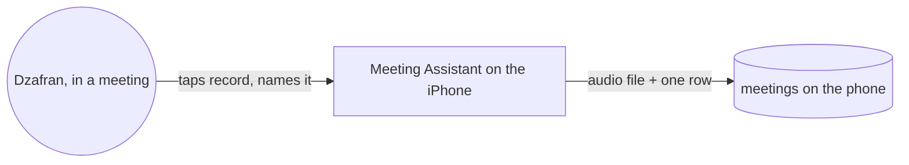
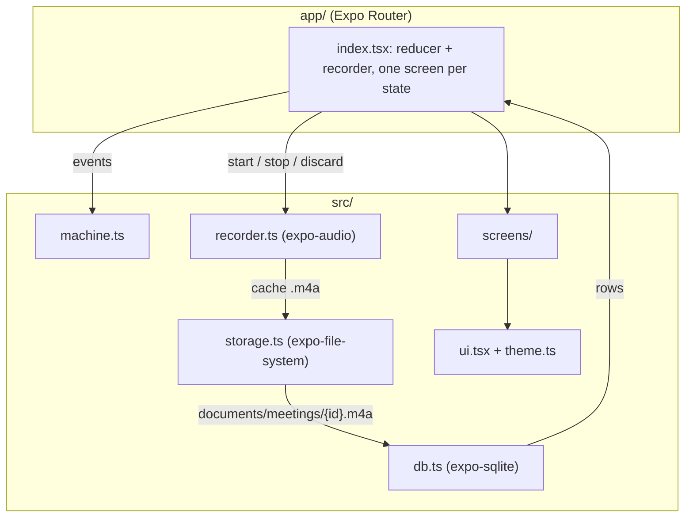

# Meeting Assistant · architecture

**Status:** Active · **Updated:** 2026-10-07 by /ship walking-skeleton

## Context

One person records a meeting; the app keeps the audio and a row about it on the phone.

## Components

| Component | Folder | Does |
| --------- | ------ | ---- |
| Route | `app/` | the one screen; holds the reducer and the recorder, renders a screen component per state |
| State machine | `src/machine.ts` | pure reducer over idle, naming, noMic, recording, stopSheet, discardConfirm, saved |
| Recorder | `src/recorder.ts` | expo-audio: permission, audio mode, start, stop with a wall-clock fallback, discard |
| Storage | `src/storage.ts` | moves the recording into `documents/meetings/`, deletes a discarded one |
| Database | `src/db.ts` | one SQLite table `meetings`, created on first open |
| Screens | `src/screens/` | list, name prompt, no-mic, recording with sheets, saved |
| UI | `src/ui.tsx`, `src/theme.ts` | Button, Control, Sheet, shared styles; theme is generated from the design tokens |
| Tokens | `scripts/tokens-to-ts.mjs` | mirrors `docs/design/design-system/tokens.css` into `src/theme.ts`; CI fails on drift |
| E2E | `.maestro/`, `.eas/workflows/` | the Maestro flow for scenario 1, run by EAS on pull requests |
