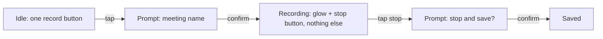

# Meeting Assistant · design brief

**Status:** Draft · 2026-10-07

## Who and where

One person, on a phone (Android and iPhone), one thumb. Opened at the start
of a meeting, glanced at once or twice to check it is still recording, then
read a day or a week later to recover what was decided. Often in a dim
meeting room or on a call with the phone lying on the desk.

## Feel

| Must feel | Must never feel |
|---|---|
| quiet | busy |
| trustworthy | fragile |
| readable | corporate |

## Reference

Gemini Live, the voice mode in the Gemini app. Taking its structure: black
screen, a small muted title top centre, a wide soft blue-to-violet aurora band
low on the screen that breathes slowly, round controls at the very bottom with
tiny labels, pill-shaped buttons and inputs. Not taking: its logo, its gradient
wordmark, its exact colours, or any asset. The structure is borrowed; the
surface is ours.

## The journey



While recording the screen holds the glow and the stop control only. No timer,
no label, no list. Trust comes from the glow moving.

## Constraints

Nothing locked. No logo, no brand colour, no font. Personal use.

| Floor | Answer | From |
|---|---|---|
| Accessibility | WCAG AA | craft floor, nothing stricter asked |
| Dark mode | dark only, no light mode (O8, accepted risk) | user's call; dim rooms, phone on a desk during calls |
| Right-to-left / CJK | no | English and Malay are both Latin script (O2 still open on the mix) |
| Oldest device | not decided, see O7 | |
| Motion ceiling | tier 1 | user chose it; only the record pulse needs motion |

## Tokens, each traced to an answer

```
phone, one thumb, read later     → 17px body, line-height 1.5, 4px spacing scale,
                                   generous padding (24px screen gutter)
both platforms, "readable"       → system font stack (SF on iOS, Roboto on Android),
                                   no webfont to load, no custom face to maintain
"quiet", "never busy"            → one accent, low saturation; at most two text
                                   sizes per screen; no icon badges, no stats
"trustworthy", "never fragile"   → recording red reserved for the recording state
                                   only; the glow is the "still recording" signal;
                                   stop asks before it saves; explicit "saved" state
"never corporate"                → near-black neutrals, no grey panels; pill radius (999px)
                                   on buttons, inputs and controls, 12px on cards
Gemini Live, soft colours        → accent is a soft sky blue (#6FA3FF); dark text on it, white fails AA
Gemini Live, "I'm listening"     → one wide aurora band (blue into violet, blurred)
                                   behind the stop control, only while recording, 3s opacity
                                   pulse. Never on an idle screen, never as decoration.
dark mode required               → dark surfaces are warm near-black, not pure black
                                   and not neon; accent desaturated further in dark
tier 1                           → 160ms ease-out on press and enter/exit; record pulse
                                   is opacity only, 2s ease-in-out, honours
                                   prefers-reduced-motion by switching to a static dot
one thumb                        → 44px minimum touch target; record control 72px,
                                   bottom-centre
```

### Type scale

| Name | Size / line | Use |
|---|---|---|
| title | 28 / 34 | screen title |
| heading | 20 / 26 | "Summary", "Decisions", "To do" |
| body | 17 / 26 | notes, transcript |
| meta | 14 / 20 | date, duration, meeting name while recording |
| label | 12 / 16 | label under a round control |

### Colour

| Token | Value | Means |
|---|---|---|
| surface | #0B0C0F | screen background |
| surface.raised | #1A1C22 | card, list row |
| text | #F1F2F4 | body |
| text.muted | #9BA1AC | meta |
| accent | #6FA3FF | the one primary control, links |
| recording | #E5484D | recording state only |
| ok | #8DB898 | "saved" |
| border | #2A2D35 | hairlines |

Contrast checked at AA for every text colour on surface.

### Recording aurora (recording only)

| Token | Value |
|---|---|
| aurora | ellipse 520×220 at bottom 120, radial from rgba(111,163,255,.95) → rgba(99,120,255,.75) at 30% → rgba(140,90,255,.45) at 55% → transparent at 75%, blur 26px |
| aurora highlight | ellipse 260×90, rgba(190,160,255,.9) → transparent at 70%, blur 22px, drifts 30px side to side over 6s |
| aurora motion | breathe: scaleY 1 → 1.25, scaleX 1 → 1.06, opacity .85 → 1, 4s ease-in-out |
| fade | 120px bottom fade to surface so the controls sit on solid black |
| reduced motion | both static |

### Spacing

4px base: 4, 8, 12, 16, 24, 32, 48. Screen gutter 24. Card padding 16.

### Radius

card 12 · button 999 · input 999 · round control 64px circle with a 12px label under it.

## Open items for the design

| ID | What | Type | Status |
|---|---|---|---|
| O7 | Oldest phone this must run on. Decides minimum OS and whether the system font stack is safe. | question | Open |
| O8 | Dark only, no light mode. The craft floor asks for both; user chose dark only for a personal app. | flag | Accepted risk, 2026-10-07 |
