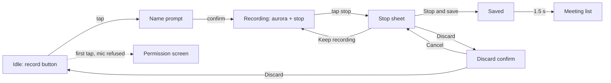
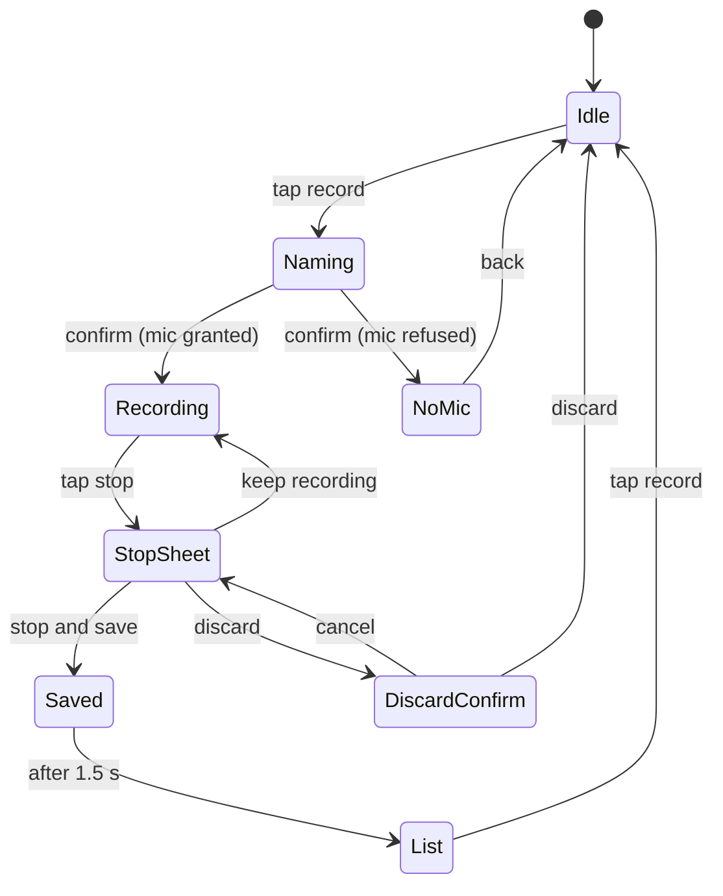
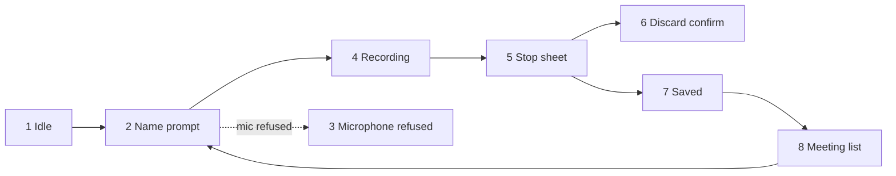
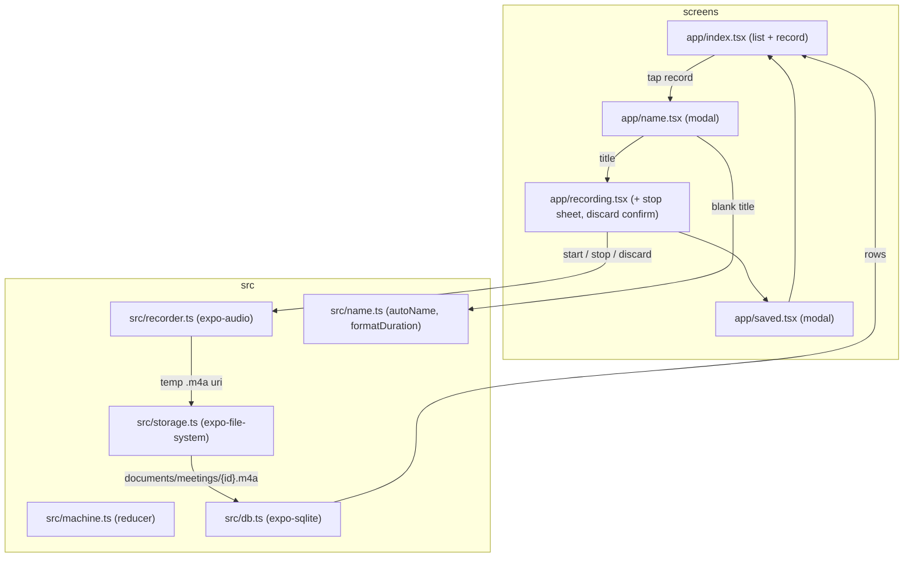
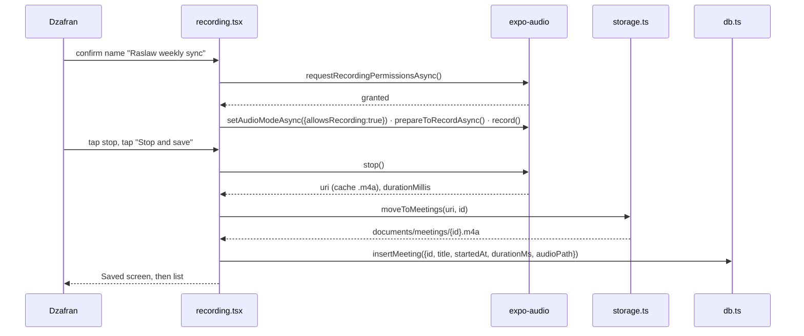
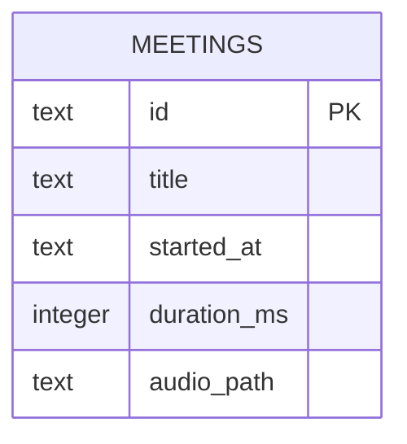

# Walking skeleton: record a meeting and save it

**Version:** v1 · **Status:** Refined · **Type:** Skeleton · **Project type:** Mobile UI (Expo)

**Shape doc:** docs/specs/meeting-assistant/shape.md
**Depends on:** None
**Page:** none. Dzafran opens the Markdown directly (global instruction: no HTML views of docs).

The app on Dzafran's iPhone: tap record, name the meeting, record, stop, confirm,
and the audio is saved and listed. Nothing is transcribed yet. This proves the
phone, the microphone, the storage, the tests and CI all work before anything
clever is built on them.

## Problem

Nothing exists. Every later slice (transcript, summary, old meetings, long
meetings) needs a phone app that can record audio and keep it. Building that
first, thin, means the unknowns about Expo, iOS microphone permission, file
storage and on-device e2e tests get answered now, not under a feature.

## Stack

Decided at pause 1. Dzafran delegated the choice; iPhone is the first test device.

| Decision | Choice | Why |
|---|---|---|
| Framework | Expo SDK (React Native), TypeScript | best audio and background-task ecosystem; runs on a real iPhone without a Mac via Expo Go |
| Storage | SQLite on the phone via expo-sqlite; audio files in the app's documents folder | no server in slice 0; nothing leaves the phone |
| Deploy target | Dzafran's iPhone through the Expo Go app; no app store | fastest path to the real device |
| CI | GitHub Actions: typecheck and Jest on every push | free, no emulator needed for unit tests |
| Unit tests | Jest with React Native Testing Library | Expo's default |
| E2E | Maestro flows, run by EAS Workflows on Expo's cloud Android emulator; iPhone by hand | Expo's documented path; GitHub's free runners can't reliably host an Android emulator |
| Package manager | pnpm | fast, strict lockfile |

## Slice test

| Check | Result |
|---|---|
| Cuts every layer it needs | yes: screen, microphone, file store, SQLite row, back to the list screen |
| One e2e test walks it | yes: scenario 1 start to finish |
| Worth shipping alone | yes: a recording of the meeting exists on the phone, which Dzafran does not have today |
| Fits (≤5 scenarios, ≤2 areas) | yes: 5 scenarios, recording and the list |

**Path:** full. Greenfield, new interface, new stack.

## User story

As Dzafran, I want to tap one button at the start of a meeting and know the
audio is being kept, so that nothing from the meeting is lost even when my
attention is.

## Flow



Tap record, name it, record, stop, choose save or discard, and the saved
meeting appears in the list.

## States



## Acceptance criteria

```gherkin
Scenario: Record a meeting and save it
  Given the app is open on the idle screen and microphone permission is granted
  When Dzafran taps record
  Then the name prompt shows the line "Recording is for your own notes. Tell the room."
  When Dzafran types "Raslaw weekly sync", taps confirm
  Then the recording screen shows the aurora, the stop control and the title "Raslaw weekly sync" and nothing else
  When Dzafran waits 5 seconds, taps stop, taps "Stop and save"
  Then the screen shows "Saved" with "Raslaw weekly sync · 5 s"
  And after 1.5 seconds the meeting list shows "Raslaw weekly sync" with today's date and "5 s"
  And an audio file of about 5 seconds exists in the app's documents folder

Scenario: Empty name is auto-named
  Given the name prompt is open on Tue 7 Oct 2026 at 15:02
  When Dzafran taps confirm without typing
  Then recording starts with the title "Meeting, Wed 7 Oct 15:02"
  And after saving, the list shows "Meeting, Wed 7 Oct 15:02"

Scenario: Keep recording from the stop sheet
  Given a recording called "DirtArmy sprint review" has run for 10 seconds
  When Dzafran taps stop, then "Keep recording"
  Then the recording screen returns and the audio continues without a gap
  And after saving, the file is about 15 seconds long, not two files

Scenario: Discard a recording
  Given a recording called "Portfolio feedback with Sam" has run for 8 seconds
  When Dzafran taps stop, taps "Discard", and on "Discard 8 s of audio? This can't be undone." taps "Discard"
  Then the idle screen returns
  And no meeting called "Portfolio feedback with Sam" is in the list
  And no audio file for it remains in the documents folder

Scenario: Microphone permission refused
  Given microphone permission has been refused in iOS Settings
  When Dzafran taps record, types "Raslaw weekly sync", taps confirm
  Then no recording starts
  And the screen says "Meeting Assistant needs the microphone to record." with an "Open Settings" button
  And tapping "Open Settings" opens the iOS Settings page for the app
```

## Scope

**In:** idle screen, name prompt, recording screen, stop sheet with save, keep
and discard, discard confirm, saved screen, meeting list, microphone permission
screen, SQLite meeting row, audio file on disk, Jest unit tests, one Maestro
e2e flow, GitHub Actions running both on push, the app running on Dzafran's
iPhone via Expo Go.

**Out:**
- Transcription, summary, decisions, to-dos: slice 1 and 2.
- Opening a past meeting from the list: slice 3. The list rows do nothing yet.
- Recording continuing with the screen locked or the app in the background,
  and recordings over a few minutes: slice 4. Slice 0 is tested with the
  screen on and recordings under a minute.
- Renaming or deleting a saved meeting: not shaped yet.
- Android testing by hand: CI covers the emulator; a real Android phone is
  later.

## Interface

Nine screens, composed from `docs/design/design-system/` only. No new
component, no new token.



| Screen | States shown | Components |
|---|---|---|
| 1 Idle | default | control-record big, label |
| 2 Name prompt | empty and focused, typed and button pressed | heading, input, meta disclaimer, btn-primary, btn-secondary |
| 3 Microphone refused | default | heading, meta, btn-primary, btn-secondary |
| 4 Recording | recording | meta title, aurora, aurora-highlight, aurora-fade, control-stop, label |
| 5 Stop sheet | open over the paused aurora | scrim, sheet, btn-primary, btn-secondary, btn-destructive |
| 6 Discard confirm | open | scrim, sheet, btn-destructive, btn-secondary |
| 7 Saved | default | check in a raised circle, heading, meta |
| 8 Meeting list | three rows, and empty on first open | title, card row, meta, empty card, control-record big |

**Motion tier:** 1. Press feedback 160 ms. The aurora breathes while recording
and holds still under the stop sheet. Reduced motion freezes it.

**Components used:** control-record, control-stop, btn-primary, btn-secondary,
btn-destructive, input, input-error, sheet, scrim, card, row, aurora,
aurora-highlight, aurora-fade, and the title, heading, meta and label text styles.

**Preview:** `docs/design/walking-skeleton/preview.html`, open it in a browser.
Editable boards for the primitives: https://claude.ai/artifact/Gn8YU2C8f3Pyn73pjMCKiZ

## Technical plan

### Approach

One Expo Router app. Two screens on disk do the work: the list (which is also
the idle screen, with the big record control) and the recording screen (which
hosts the stop sheet and the discard confirm). The name prompt and the saved
screen are small modals. A pure reducer holds the state machine from pause 1 so
Jest can test every transition without a phone. Recording goes through
expo-audio; the file lands in the app's documents folder; one SQLite row per
meeting.

Relies on: D1, D2, D3, D4, D5



The list screen opens the name modal, the recording screen drives the recorder,
the saved file's path goes into one SQLite row, and the list reads it back.



Permission refused at step 2 routes to the permission screen and nothing else
runs. Discard calls `stop()` then deletes the cache file and writes no row.
"Keep recording" closes the sheet and calls nothing: the recorder never paused.

### Changes

Greenfield. Every file is new.

| File | What | Why |
|---|---|---|
| `package.json`, `pnpm-lock.yaml`, `tsconfig.json`, `app.json`, `babel.config.js` | Expo SDK 57 app, TypeScript strict, expo-router, expo-audio plugin with `microphonePermission: "Meeting Assistant needs the microphone to record."` | all scenarios; scenario 5 copy |
| `jest.config.js`, `jest.setup.ts` | jest-expo preset; mocks for expo-audio, expo-sqlite, expo-file-system | unit tests run without a phone |
| `src/name.ts` | `autoName(date)` → "Meeting, Wed 7 Oct 15:02"; `formatDuration(ms)` → "5 s", "48 min", "1 h 12 min" | scenarios 1, 2 |
| `src/machine.ts` | reducer over the pause 1 state diagram: idle, naming, noMic, recording, stopSheet, discardConfirm, saved | scenarios 1 to 5, tested in Jest |
| `src/recorder.ts` | `start()`, `stop()`, `discard()` over `useAudioRecorder(RecordingPresets.HIGH_QUALITY)`; permission check; `setAudioModeAsync` | scenarios 1, 3, 4, 5 |
| `src/storage.ts` | `moveToMeetings(uri, id)`, `deleteRecording(uri)`; folder `documents/meetings/` | scenarios 1, 4 |
| `src/db.ts` | `openDb()` creates `meetings` on first run; `insertMeeting`, `listMeetings` | scenarios 1, 2, 4 |
| `app/_layout.tsx` | router stack, dark theme from `tokens.css` values as a TS object | all |
| `app/index.tsx` | list or empty card, big record control, "Meeting Assistant" title | scenarios 1, 2, 4 |
| `app/name.tsx` | name modal, blank → `autoName`, disclaimer line under the field | scenarios 1, 2 (O1) |
| `app/recording.tsx` | aurora, stop control, stop sheet, discard confirm, permission screen with `Linking.openSettings()` | scenarios 1, 3, 4, 5 |
| `app/saved.tsx` | saved modal, 1.5 s then back to index | scenario 1 |
| `src/theme.ts` | the design tokens as a TypeScript object, generated from `docs/design/design-system/tokens.css` by `scripts/tokens-to-ts.mjs` | drift check: no hex outside tokens |
| `.maestro/record-and-save.yml` | the one e2e flow: scenario 1 | e2e |
| `.github/workflows/ci.yml` | pnpm install, `tsc --noEmit`, `jest` on push and PR | CI |
| `.eas/workflows/e2e-android.yml`, `eas.json` | `e2e-test` build profile (apk, withoutCredentials) then the maestro job on PR | e2e in the cloud |

Reusing: nothing yet. The design system's tokens are the one shared input.

### Data



**Migration:** `CREATE TABLE IF NOT EXISTS meetings` on first open, user_version 1.
No backfill, nothing to switch.
**Reverse:** delete the app from the phone. The database and the audio live
inside the app's sandbox and go with it. Tested by hand once in chunk B.

### Earn-it

| Added | Triggered by |
|---|---|
| `src/machine.ts` reducer | scenarios 3, 4, 5 have branches that must be tested without a phone |
| `scripts/tokens-to-ts.mjs` | the drift gate: React Native cannot read CSS, so tokens must be mirrored, and a generator stops the mirror drifting |
| expo-sqlite | scenario 1 needs the list to survive an app restart; a JSON file would need its own locking |
| EAS Workflows | scenario 1 e2e in CI; GitHub free runners cannot host the Android emulator reliably |
| Maestro | the one e2e; Detox needs a native build toolchain on the runner |

Not added: a server, auth, analytics, a state library, a UI kit. Nothing in
the five scenarios asks for them.

### Non-functionals

|  |  |
|---|---|
| **Load** | one user, a few recordings a day, files of 1 to 60 MB each |
| **Breaks first** | phone storage. At 10× (hundreds of hour-long files) the documents folder fills; slice 3 adds delete. The list query is unindexed but trivial at this size. |
| **Security surface** | only the phone's owner can open it · trusts the microphone and the title field (stored as text, never executed) · no secrets · stores audio and titles in the app sandbox, nothing leaves the phone |
| **Proof it works** | `console.log("meeting saved", {id, durationMs, bytes})` after insert; in the list, the new row with the right duration |
| **Rollout** | no flag. Expo Go on the phone; rollback is reloading the previous commit in Expo Go. |

### Test plan

| Scenario | Test | Command |
|---|---|---|
| 1 Record and save | `.maestro/record-and-save.yml` | `maestro test .maestro/record-and-save.yml` (local emulator) / EAS workflow on PR |
| 1, 3, 4, 5 transitions | `src/__tests__/machine.test.ts` | `pnpm test` |
| 2 Auto-name, durations | `src/__tests__/name.test.ts` | `pnpm test` |
| 1, 4 file move and delete | `src/__tests__/storage.test.ts` with expo-file-system mocked | `pnpm test` |
| 1, 2, 4 rows | `src/__tests__/db.test.ts` with expo-sqlite mocked to an in-memory array | `pnpm test` |
| 3, 4, 5 on a real phone | by hand on the iPhone via Expo Go, checklist in the PR | — |

**E2E:** `.maestro/record-and-save.yml`: launch, tap Record, type "Raslaw weekly
sync", tap "Start recording", wait 5 s, tap Stop, tap "Stop and save", assert
"Saved", assert the list shows "Raslaw weekly sync" and "5 s". No e2e harness
exists yet; setting up Maestro locally and the EAS workflow is chunk C.

### Chunks

| Chunk | Scenarios | Files owned |
|---|---|---|
| A | 2, machine | `package.json`, `pnpm-lock.yaml`, `tsconfig.json`, `app.json`, `babel.config.js`, `jest.config.js`, `jest.setup.ts`, `src/name.ts`, `src/machine.ts`, `src/theme.ts`, `scripts/tokens-to-ts.mjs`, `src/__tests__/name.test.ts`, `src/__tests__/machine.test.ts`, `.github/workflows/ci.yml` |
| B | 1, 3, 4, 5 | `src/recorder.ts`, `src/storage.ts`, `src/db.ts`, `src/__tests__/storage.test.ts`, `src/__tests__/db.test.ts`, `app/_layout.tsx`, `app/index.tsx`, `app/name.tsx`, `app/recording.tsx`, `app/saved.tsx` |
| C | 1 e2e | `.maestro/record-and-save.yml`, `eas.json`, `.eas/workflows/e2e-android.yml` |

B depends on A. C depends on B. Shared config and the lockfile belong to A.

### Risks

| Risk | Mitigation |
|---|---|
| Expo Go on iOS stops recording when the screen locks | out of scope for slice 0 and stated so; slice 4 owns it and will need a dev build with `UIBackgroundModes: audio` |
| Maestro cannot find the text field or the round controls on Android | every tappable gets a `testID`; the flow uses ids, not text, for controls |
| EAS free plan runs out of builds in a busy week | the e2e workflow runs on PR only, not every push; local `maestro test` on an Android emulator is the fallback |
| expo-sqlite API differs between SDK 57 and what I remember | chunk A pins SDK 57 and reads the installed types before chunk B writes `db.ts` |
| Duration from `stop()` is missing or zero on iOS | fall back to wall-clock from `record()` to `stop()`, which is what the user sees anyway |

### Decisions to record

Recorded as D2, D3, D4, D5.

## Open items

| ID | What | Type | Raised at | Owner | Status | Answer |
| -- | ---- | ---- | --------- | ----- | ------ | ------ |
| O1 | Is Dzafran allowed to record these meetings (work policy, other people's consent)? (from shape O3) | flag | shape | user | Resolved | Allowed. The name prompt carries a one-line disclaimer: "Recording is for your own notes. Tell the room." Encryption and retention are a later slice. |
| O2 | Oldest iPhone and iOS version this must run on. Decides the Expo SDK and iOS floor. (from shape O7) | question | shape | user | Resolved | iOS 16 and up, SDK 57's own floor. Nothing older is targeted. |
| O3 | Assuming Expo Go on iPhone can record from the microphone with the screen on, without a custom native build. | unproven | spec p1 | poc | Resolved | Expo docs for SDK 57: expo-audio is included in Expo Go and records to .m4a on iOS. Confirmed on the phone in chunk B. |
| O4 | Assuming Maestro can drive the Expo app on the GitHub Actions Android emulator within a free-tier job time. | unproven | spec p1 | poc | Resolved | Dropped. GitHub free runners can't reliably host the emulator; e2e moves to EAS Workflows (D4). |
| O5 | Assuming a GitHub repo will exist for this project. CI needs one. | assumption | spec p1 | user | Resolved | Yes. Dzafran creates it; chunk A's CI file assumes GitHub. |
| O6 | Assuming an Expo account on the free plan covers the e2e builds and Maestro runs for a one-person project. | assumption | spec p3 | user | Resolved | Yes. Dzafran signs up at expo.dev; chunk C logs in with `eas login`. |
| O7 | Assuming `stop()` on iOS returns a usable duration; otherwise wall-clock. | assumption | spec p3 | build | Accepted risk | Fallback is written into the plan and costs nothing. 2026-10-07 |

_Never delete this section or its rows. See references/ledger.md._

## Glossary

- **Expo** — a toolkit on top of React Native that builds phone apps from TypeScript and runs them on a real phone through the Expo Go app without an app store
- **Expo Go** — the free app from the App Store that loads your project onto your phone while developing
- **expo-sqlite** — Expo's module for a small SQL database stored on the phone
- **Maestro** — a tool that taps through a phone app from a YAML script, used for the end-to-end test
- **e2e** — end-to-end: one test that walks the whole slice as a user would
- **EAS Workflows** — Expo's hosted CI: builds the app and runs the Maestro flow on an emulator in Expo's cloud
- **Expo Router** — file-based screens: a file in `app/` is a screen
- **Reducer** — a pure function from (state, event) to the next state; the state machine lives here so it can be tested without a phone
- **Walking skeleton** — the thinnest path through every layer, deployed, so later work has nothing structural left to discover
