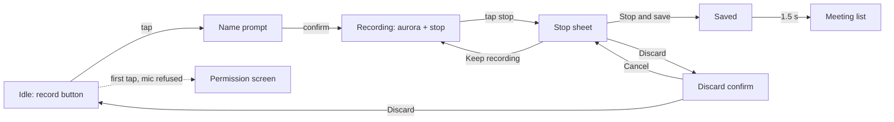
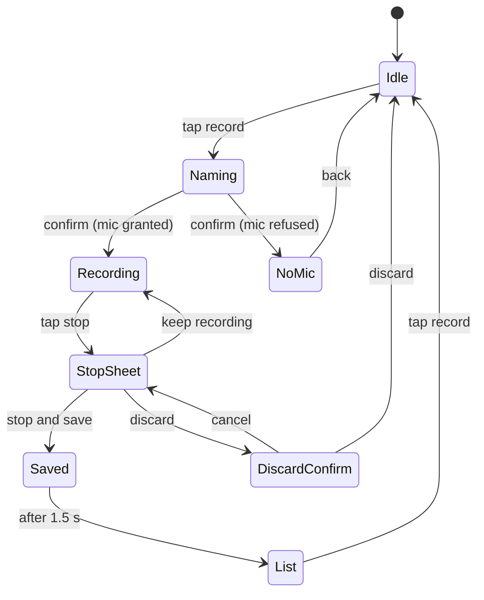

# Walking skeleton: record a meeting and save it

**Version:** v1 · **Status:** Draft · **Type:** Skeleton · **Project type:** Mobile UI (Expo)

**Shape doc:** docs/specs/meeting-assistant/shape.md
**Depends on:** None
**Page:** _added at the end of pause 3_

The app on Dzafran's iPhone: tap record, name the meeting, record, stop, confirm,
and the audio is saved and listed. Nothing is transcribed yet. This proves the
phone, the microphone, the storage, the tests and CI all work before anything
clever is built on them.

## Problem

Nothing exists. Every later slice (transcript, summary, old meetings, long
meetings) needs a phone app that can record audio and keep it. Building that
first, thin, means the unknowns about Expo, iOS microphone permission, file
storage and on-device e2e tests get answered now, not under a feature.

## Stack

Decided at pause 1. Dzafran delegated the choice; iPhone is the first test device.

| Decision | Choice | Why |
|---|---|---|
| Framework | Expo SDK (React Native), TypeScript | best audio and background-task ecosystem; runs on a real iPhone without a Mac via Expo Go |
| Storage | SQLite on the phone via expo-sqlite; audio files in the app's documents folder | no server in slice 0; nothing leaves the phone |
| Deploy target | Dzafran's iPhone through the Expo Go app; no app store | fastest path to the real device |
| CI | GitHub Actions, Android emulator | iOS simulators need paid macOS minutes |
| Unit tests | Jest with React Native Testing Library | Expo's default |
| E2E | Maestro flows; Android emulator in CI, iPhone by hand | YAML flows, no native build needed |
| Package manager | pnpm | fast, strict lockfile |

## Slice test

| Check | Result |
|---|---|
| Cuts every layer it needs | yes: screen, microphone, file store, SQLite row, back to the list screen |
| One e2e test walks it | yes: scenario 1 start to finish |
| Worth shipping alone | yes: a recording of the meeting exists on the phone, which Dzafran does not have today |
| Fits (≤5 scenarios, ≤2 areas) | yes: 5 scenarios, recording and the list |

**Path:** full. Greenfield, new interface, new stack.

## User story

As Dzafran, I want to tap one button at the start of a meeting and know the
audio is being kept, so that nothing from the meeting is lost even when my
attention is.

## Flow



Tap record, name it, record, stop, choose save or discard, and the saved
meeting appears in the list.

## States



## Acceptance criteria

```gherkin
Scenario: Record a meeting and save it
  Given the app is open on the idle screen and microphone permission is granted
  When Dzafran taps record, types "Raslaw weekly sync", taps confirm
  Then the recording screen shows the aurora, the stop control and the title "Raslaw weekly sync" and nothing else
  When Dzafran waits 5 seconds, taps stop, taps "Stop and save"
  Then the screen shows "Saved" with "Raslaw weekly sync · 5 s"
  And after 1.5 seconds the meeting list shows "Raslaw weekly sync" with today's date and "5 s"
  And an audio file of about 5 seconds exists in the app's documents folder

Scenario: Empty name is auto-named
  Given the name prompt is open on Tue 7 Oct 2026 at 15:02
  When Dzafran taps confirm without typing
  Then recording starts with the title "Meeting, Tue 7 Oct 15:02"
  And after saving, the list shows "Meeting, Tue 7 Oct 15:02"

Scenario: Keep recording from the stop sheet
  Given a recording called "DirtArmy sprint review" has run for 10 seconds
  When Dzafran taps stop, then "Keep recording"
  Then the recording screen returns and the audio continues without a gap
  And after saving, the file is about 15 seconds long, not two files

Scenario: Discard a recording
  Given a recording called "Portfolio feedback with Sam" has run for 8 seconds
  When Dzafran taps stop, taps "Discard", and on "Discard 8 s of audio? This can't be undone." taps "Discard"
  Then the idle screen returns
  And no meeting called "Portfolio feedback with Sam" is in the list
  And no audio file for it remains in the documents folder

Scenario: Microphone permission refused
  Given microphone permission has been refused in iOS Settings
  When Dzafran taps record, types "Raslaw weekly sync", taps confirm
  Then no recording starts
  And the screen says "Meeting Assistant needs the microphone to record." with an "Open Settings" button
  And tapping "Open Settings" opens the iOS Settings page for the app
```

## Scope

**In:** idle screen, name prompt, recording screen, stop sheet with save, keep
and discard, discard confirm, saved screen, meeting list, microphone permission
screen, SQLite meeting row, audio file on disk, Jest unit tests, one Maestro
e2e flow, GitHub Actions running both on push, the app running on Dzafran's
iPhone via Expo Go.

**Out:**
- Transcription, summary, decisions, to-dos: slice 1 and 2.
- Opening a past meeting from the list: slice 3. The list rows do nothing yet.
- Recording continuing with the screen locked or the app in the background,
  and recordings over a few minutes: slice 4. Slice 0 is tested with the
  screen on and recordings under a minute.
- Renaming or deleting a saved meeting: not shaped yet.
- Android testing by hand: CI covers the emulator; a real Android phone is
  later.

## Open items

| ID | What | Type | Raised at | Owner | Status | Answer |
| -- | ---- | ---- | --------- | ----- | ------ | ------ |
| O1 | Is Dzafran allowed to record these meetings (work policy, other people's consent)? (from shape O3) | flag | shape | user | Open | — |
| O2 | Oldest iPhone and iOS version this must run on. Decides the Expo SDK and iOS floor. (from shape O7) | question | shape | user | Open | — |
| O3 | Assuming Expo Go on iPhone can record from the microphone with the screen on, without a custom native build. | unproven | spec p1 | poc | Open | — |
| O4 | Assuming Maestro can drive the Expo app on the GitHub Actions Android emulator within a free-tier job time. | unproven | spec p1 | poc | Open | — |
| O5 | Assuming a GitHub repo will exist for this project. CI needs one. | assumption | spec p1 | user | Open | — |

_Never delete this section or its rows. See references/ledger.md._

## Glossary

- **Expo** — a toolkit on top of React Native that builds phone apps from TypeScript and runs them on a real phone through the Expo Go app without an app store
- **Expo Go** — the free app from the App Store that loads your project onto your phone while developing
- **expo-sqlite** — Expo's module for a small SQL database stored on the phone
- **Maestro** — a tool that taps through a phone app from a YAML script, used for the end-to-end test
- **e2e** — end-to-end: one test that walks the whole slice as a user would
- **Walking skeleton** — the thinnest path through every layer, deployed, so later work has nothing structural left to discover
